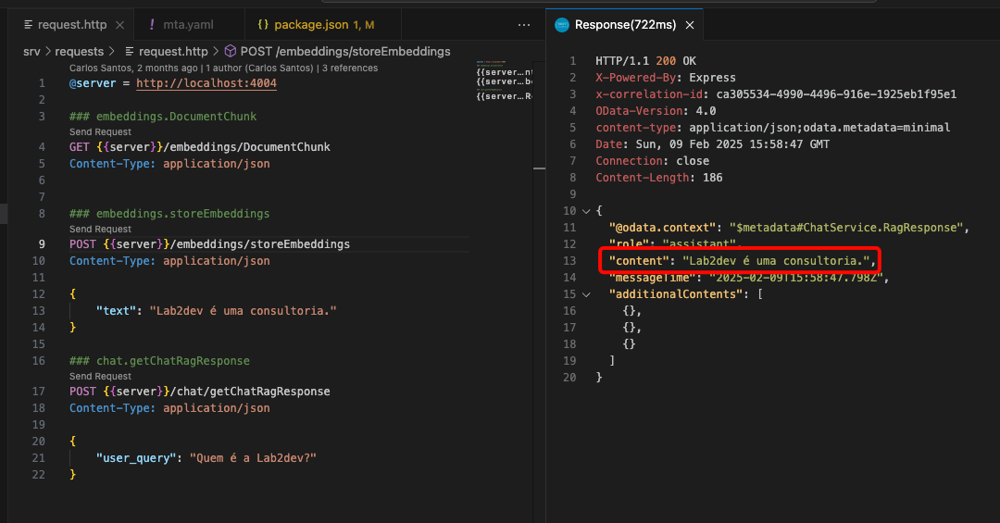

# Desafio - Pro-code

Agora, você fará uma implementação prática, utilizando a instância AI Core, junto ao conceito de RAG, com o HANA Cloud Vector.

👉 No BAS, clone o repositório: [CAP AI Demo](https://github.com/caarloseduardo/cap-ai-demo).

👉 Faça deploy dessa aplicação, buildando o MTA, e executando o deploy do arquivo `cap-ai-demo_1.0.0.mtar`, dentro da pasta `mta_archives`.
OBS: É necessário o HANA Cloud instanciado.

👉 Agora, faça o bind das instâncias criadas, com os seguintes códigos:
1. `cds bind -2 cap-ai-demo-cap-db:cap-ai-demo-cap-db`
2. `cds bind -2 cap-ai-demo-cap-destination:cap-ai-demo-cap-destination`

👉 Feito isso, altere a linha 54 e 61 do arquivo `package.json`.
1. Na linha 54, coloque o deployment ID do gpt-4o: /v2/inference/deployments/`{deploymentID}`
2. Na linha 61, coloque o deployment ID do text-embedding-ada-002: /v2/inference/deployments/`{deploymentID}`

👉 Agora, importe a destination `aicore-destination`, que está nessa pasta. Ao importar, preencha as credenciais `Client Secret` e `Client ID`.

👉 Pronto, teste sua aplicação funcionando, com as requisições no arquivo `/srv/requests/request.http`.

