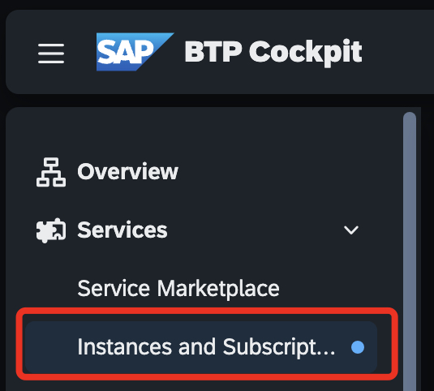
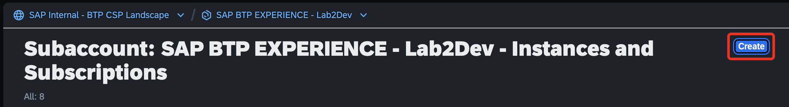
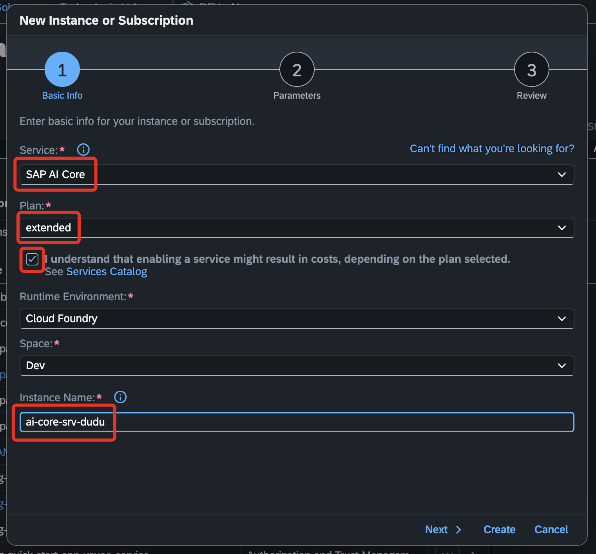
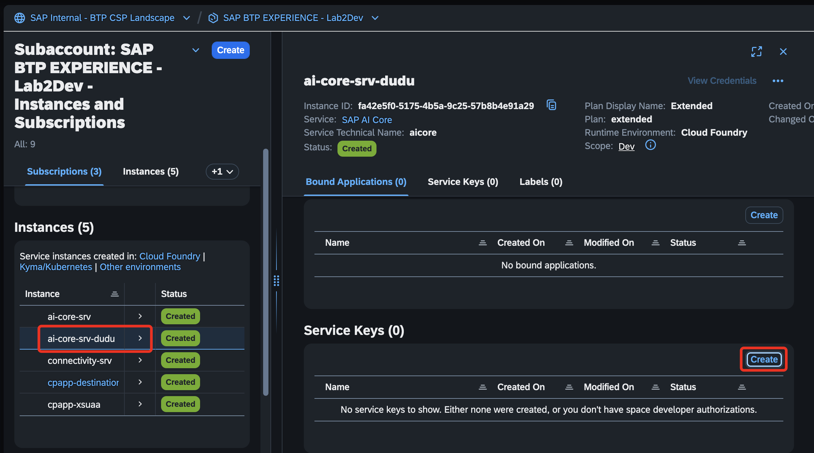
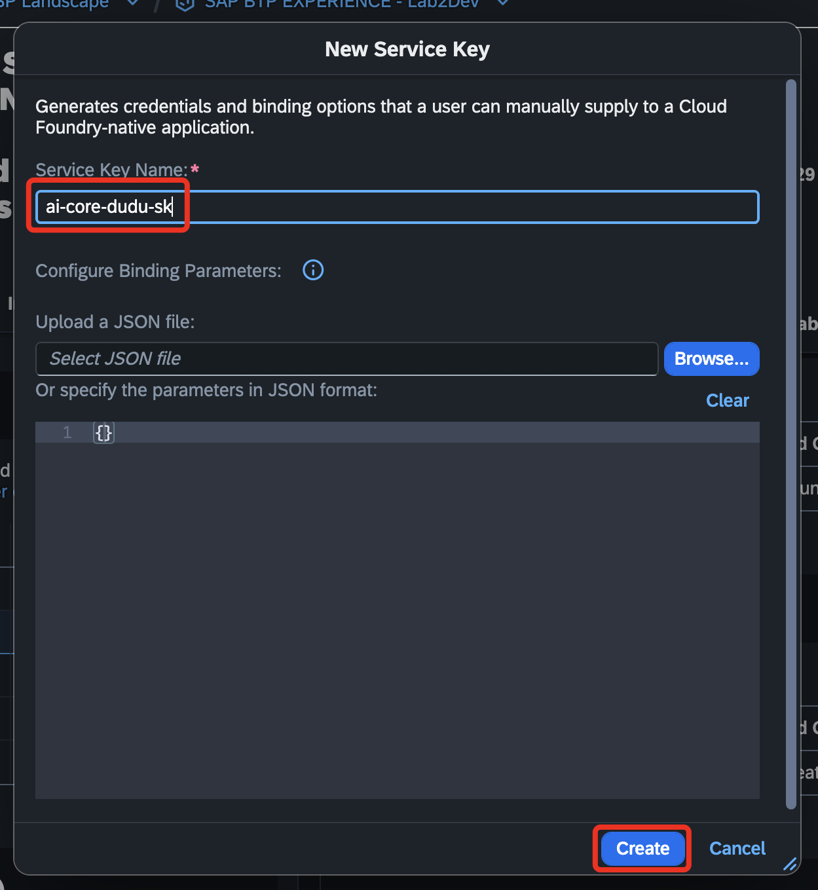

# Exercício 1 - Criação da Instância e Service Key do AI Core

Neste exercício, você criará a sua instância, e o Service Key do AI Core.

## Instances and Subscriptions

👉 No menu de **_"Services"_**, selecione a opção **_"Instances and Subscriptions"_**.

👉 Selecione a opção **_"Create"_**, no canto superior direito.

👉 Dentro de service, selecione a opção **_"SAP AI Core"_**, e o plano, selecion o plano **_"Extended"_**

👉 Coloque o nome da sua instância de `ai-core-srv-${seunome}`, marque a opção _"I understand that enabling a service might result in costs, depending on the plan selected."_, e clique em **_"Create"_**.

👉 Selecione a instância que acabou de criar, e dentro da opção **_"Service Key"_**, clique em **_"Create"_**.

👉 Agora, coloque o nome da Service Key de: `ai-core-${seunome}-sk`, e clique em **_"Create"_**.

Agora continue para o [Exercício 2](../ex2/README.md), onde você usará a sua instância dentro do AI Launchpad.