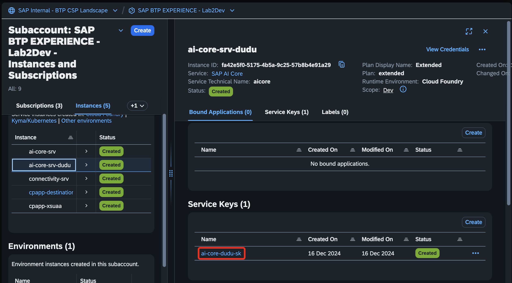
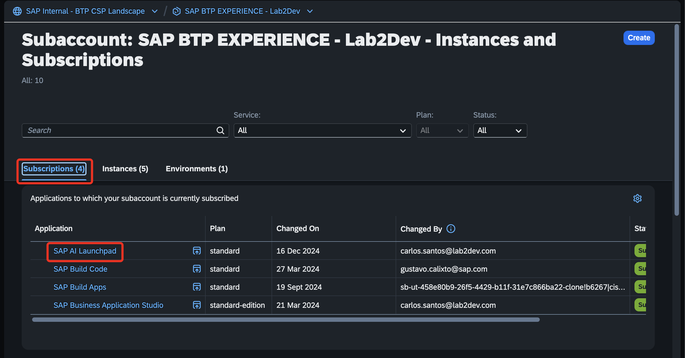
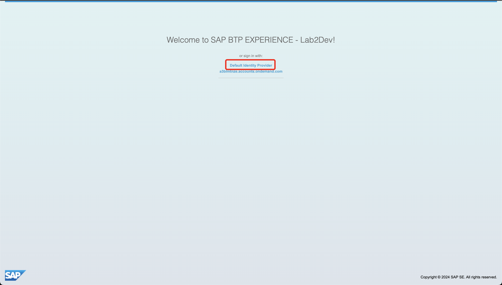
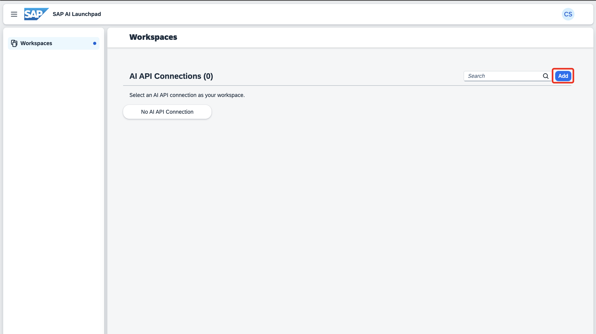
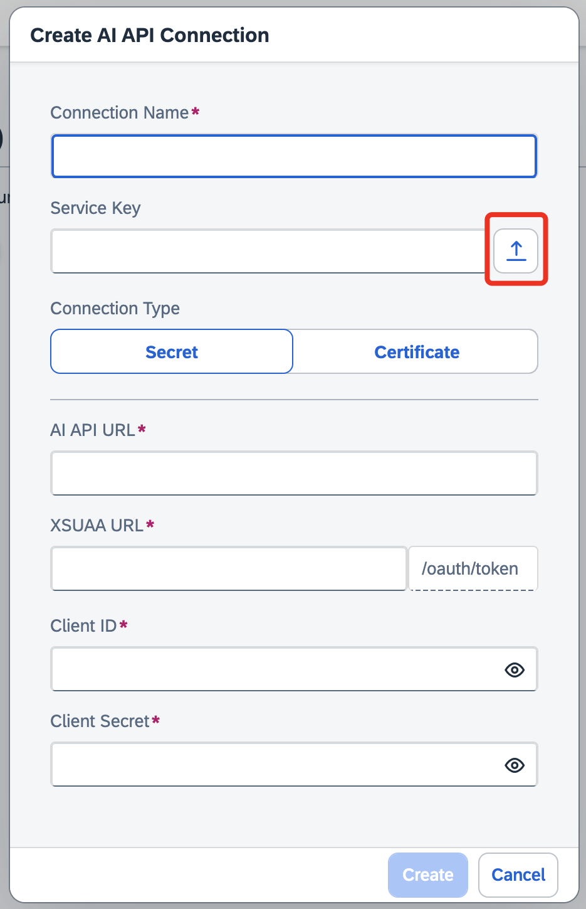
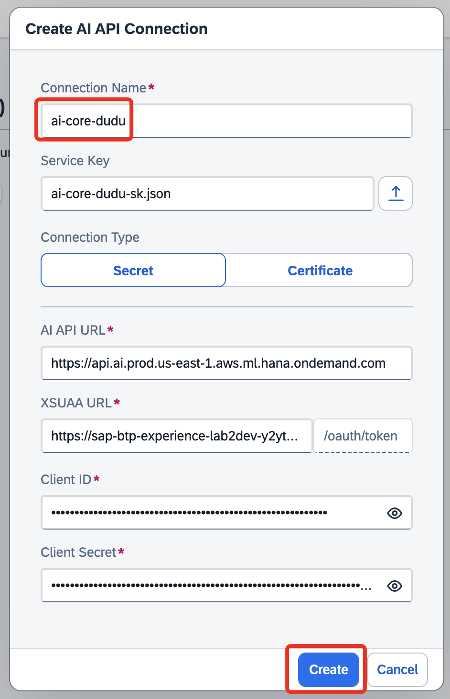

# Exercício 2 - Utilização da Instância criada no AI Launchpad

Neste exercício, você utilizará a instância criada dentro do AI Launchpad.

👉 Ainda dentro da sua instância, selecione a service que criada.

👉 Agora, com a opção **_"JSON"_** selecionada, clique em **_"Download"_**.

👉 Para abrirmos o AI Launchpad, vamos dentro de **_"Subscriptions"_**, e vamos selecionar o serviço já criada do **_"AI Launchpad"_**.

👉 Com o AI Launchpad aberto, selecione a opção **_"Default Identity Provider"_**, e se autentique.

👉 Depois de autenticado, vamos agora adicionar a API Connection do nosso AI Core, selecionando a opção **_"Add"_**.

👉 Clique no botão de upload, e selecione a Service Key baixada anteriormente.

👉 Preencha o nome com `ai-core-${seunome}`, e clique em **_"Create"_**.

Agora continue para o [Exercício 3](../ex3/README.md), onde vamos criar as configurações e deployments.