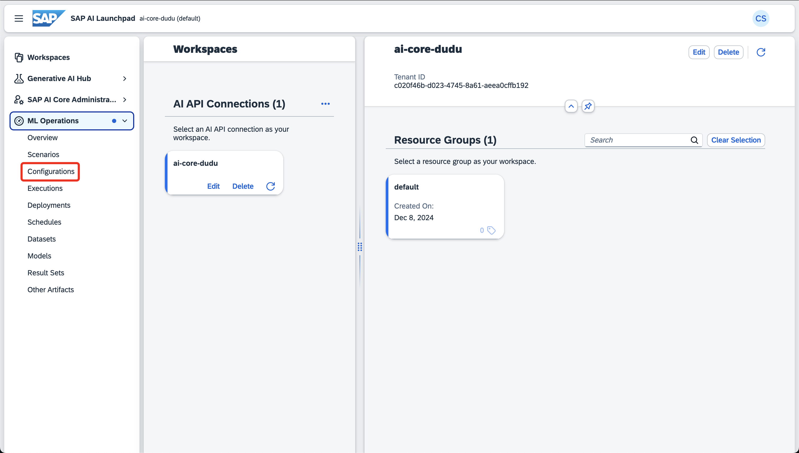
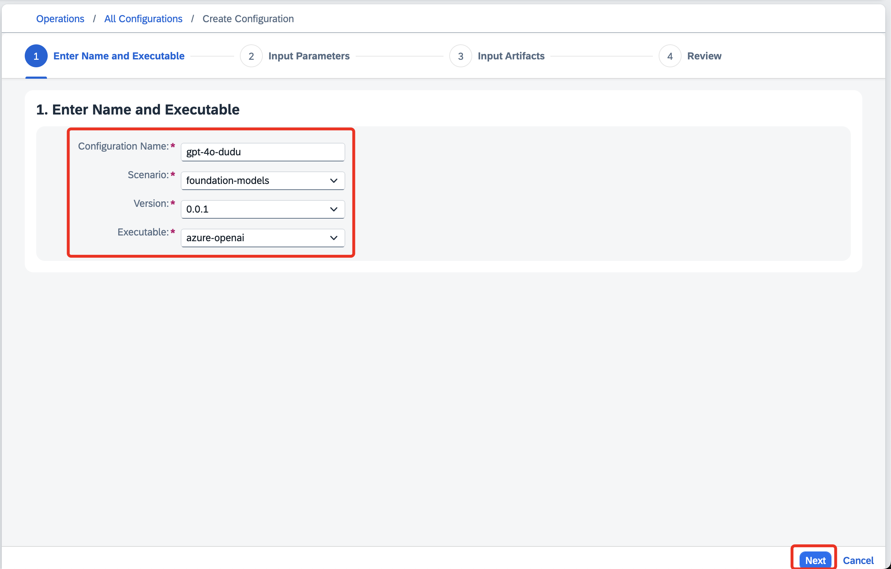
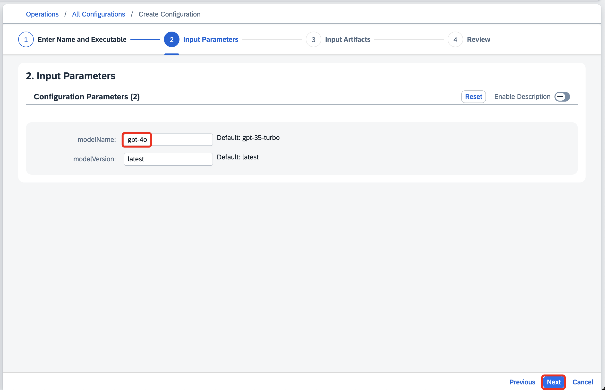
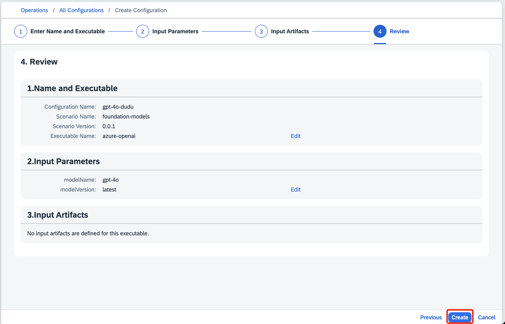
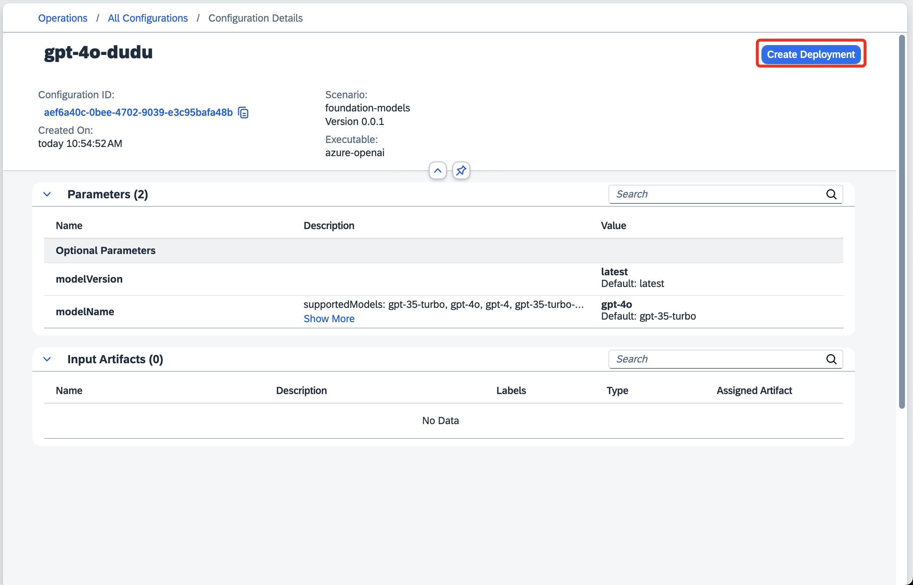
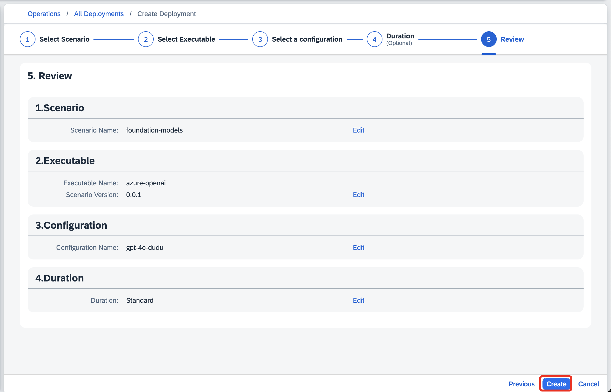
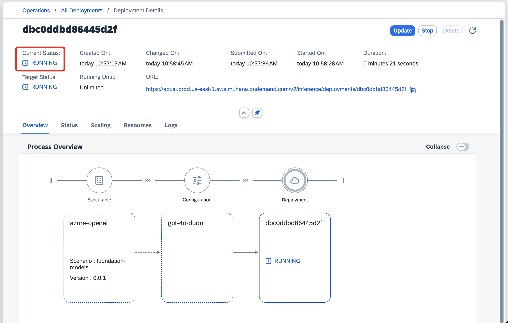

# Exercício 3 - ML Operations (Configurações e Deploys)

Neste exercício, você criará as configurações de ML Operations.

👉 Selecione a aba de **_"ML Operations"_**, e a opção **_"Configurations"_**.

👉 Clique em **_"Create"_**, preencha os campos:

  | Nome | Valor |
  |:-----------|:-----------|
  | Configuration Name | **`gtp-4o-${seunome}`** |
  | Scenario | **foundation-models** |
  | Version | **0.0.1** |
  | Executable | **azure-openai**|

E clique em **_"Next"_**.

👉 Nos Input Parameters, vamos alterar o Model Name para **_"gpt-4o"_**, ([Para ver os modelos disponíveis](https://help.sap.com/docs/ai-launchpad/sap-ai-launchpad/generative-ai-hub)), e selecionar **_"Next"_**:

👉 Nos Input Artifacts, clique em **_"Review"_**, e em **_"Review"_**, clique em **_"Create"_**.

👉 Com a configuração criada, clique em **_"Create Deployment"_**.

👉 Na primeira tela, clique em **_"Review"_**, depois **_"Create"_**,

Espere seu deploy ficar com o Current Status **_"Running"_**.

Agora continue para o [Exercício 4](../ex4/README.md), onde vamos usar o Prompt Editor.