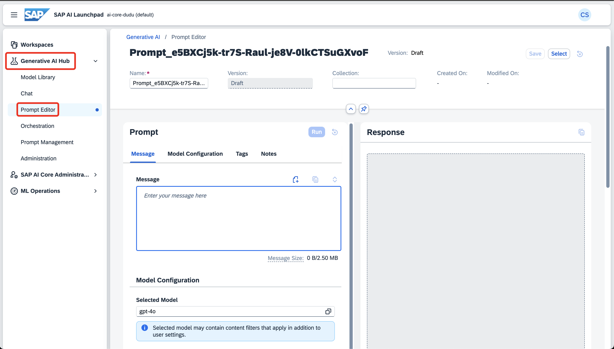
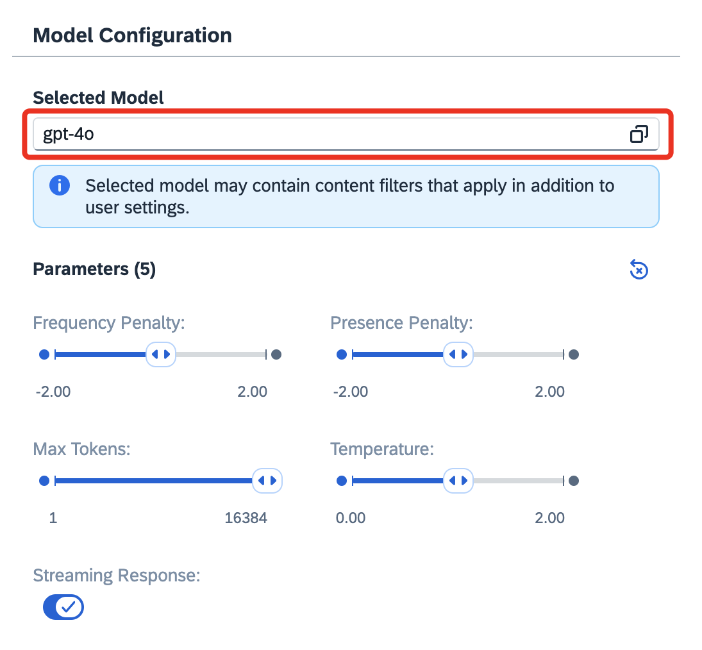
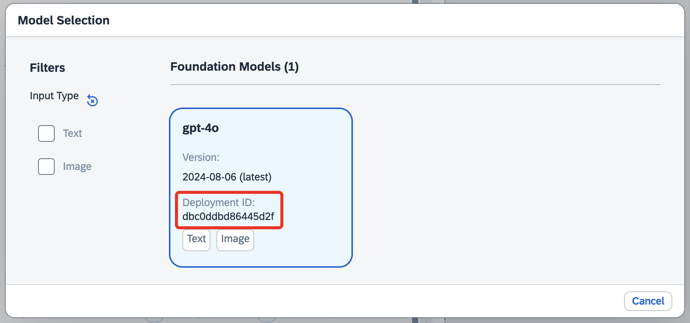
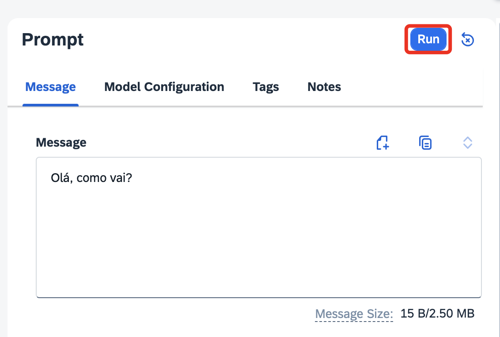
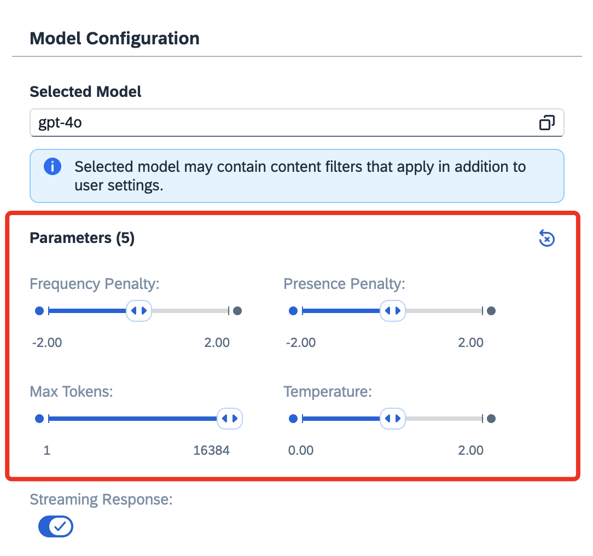

# Exercício 4 - Prompt Editor

Neste exercício, você usará o Prompt Editor com as configurações que acabamos de criar.

👉 Selecione a aba de **_"Generative AI Hub"_**, e a opção **_"Prompt Editor"_**.

👉 Clique em **_"Selected Model"_**, para selecionarmos o modelo que criamos no exercício anterior.

👉 Selecione o modelo criado no exercício anterior. Você pode confirmar pelo **_"Deployment ID"_**.

👉 Agora, você pode testar seu modelo escrevendo algo na sessão **_"Message"_**, e clicando em **_"Run"_**

👉 Teste também alterar os parâmetros disponíveis, e ver a diferença nas respostas. 

Os parâmetros são os seguintes:

  | Nome | Valor |
  |:-----------|:-----------|
  | Frequency Penalty | Reduz a probabilidade de repetição de tokens já usados com frequência. |
  | Presence Penalty | Diminui a probabilidade de repetição de ideias já mencionadas. |
  | Max Tokens | Define o limite máximo de tokens na resposta. |
  | Temperature | Ajusta o grau de aleatoriedade na escolha dos próximos tokens. |

Agora, como próximos passos, você pode criar uma aplicação back-end em Node.js usando o SAP CAP (Cloud Application Programming Model). Continue para o [Desafio Pro-code](../challenge/README.md), para fazer uma implementação prática de sua instância AI Core.